<div align="center">

# Sistema de Análisis de Movilidad Urbana y Transporte


Base de datos relacional completa para una **plataforma de movilidad urbana** (al estilo de Uber, DiDi o Cabify): diseño normalizado, cuatro meses de operación simulada, automatización con triggers, vistas, procedimientos y funciones, y cinco **consultas analíticas** listas para un flujo de ciencia de datos. Las mismas consultas se replican en un **notebook de Python** a partir de datos exportados a CSV.

</div>

> Los datos son **sintéticos**: se generan con un procedimiento almacenado que simula la operación de junio a septiembre de 2024, con horas pico, fines de semana y estacionalidad.

<p align="center">
  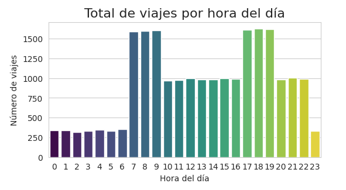
  <br>
  <em>Figura: Distribución de los viajes por hora en la base de datos generada</em>
</p>

---

## Contenido

- [Qué incluye](#-qué-incluye)
- [Flujo del proyecto](#-flujo-del-proyecto)
- [Modelo de datos](#-modelo-de-datos)
- [Estructura del repositorio](#-estructura-del-repositorio)
- [Objetos de base de datos](#-objetos-de-base-de-datos)
- [Cómo probarlo](#-cómo-probarlo)
- [Consultas analíticas](#-consultas-analíticas)
- [Notebook en Python](#-notebook-en-python)
- [Habilidades que demuestra](#-habilidades-que-demuestra)
- [Limitaciones y mejoras posibles](#-limitaciones-y-mejoras-posibles)
- [Autor y licencia](#-autor-y-licencia)

---

## Qué incluye

- **Diseño normalizado** con integridad referencial e índices pensados para las consultas analíticas más frecuentes.
- **Datos de prueba** de 4 meses (junio–septiembre de 2024) con patrones realistas de demanda.
- **Auditoría automática** de cambios de tarifa y validación de reglas de negocio mediante triggers.
- **Vistas, procedimientos almacenados y una función** de tarifa dinámica.
- **Cinco consultas analíticas avanzadas** orientadas a ciencia de datos.
- **Notebook de Jupyter** que replica las consultas en Python a partir de los datos exportados a CSV.

## Flujo del proyecto

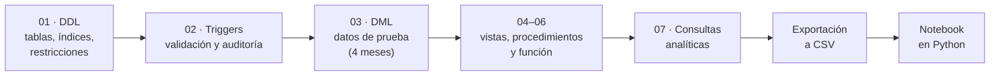

## Modelo de datos

<p align="center">
  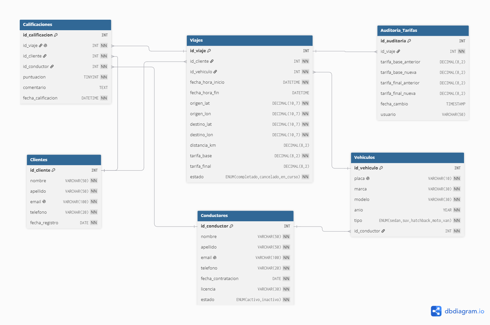
  <br>
  <em>Figura: Diagrama entidad-relación</em>
</p>

- **Conductores** y **Vehículos**: relación 1:N.
- **Clientes** que solicitan **Viajes**.
- **Calificaciones** asociadas a cada viaje: relación 1:1 con Viajes.
- **Auditoría de tarifas**, alimentada automáticamente por triggers.

## Estructura del repositorio

```text
.
├── data/                          # Datos exportados para el notebook
├── images/                        # Diagrama ER y resultados de las consultas
├── movilidad_urbana/              # Scripts SQL (ejecutar en orden 01 → 07)
│   ├── 01_DDL.sql
│   ├── 02_Triggers.sql
│   ├── 03_DML.sql
│   ├── 04_Vistas.sql
│   ├── 05_Procedimientos.sql
│   ├── 06_Funcion.sql
│   └── 07_Consultas_Analiticas.sql
├── notebooks/
│   └── analisis_movilidad_urbana.ipynb
├── LICENSE
└── README.md
```

| Script | Contenido |
|---|---|
| `01_DDL.sql` | Creación de la base de datos, tablas, índices y restricciones |
| `02_Triggers.sql` | Triggers de validación de fechas y auditoría de cambios en tarifas |
| `03_DML.sql` | Procedimiento `sp_generar_datos_prueba`, que inserta 4 meses de datos realistas y activa la auditoría |
| `04_Vistas.sql` | Vistas `vista_ingresos_diarios`, `vista_conductores_top` y `vista_demanda_horaria` |
| `05_Procedimientos.sql` | Procedimientos `sp_reporte_ingresos` y `sp_conductores_mejor_rendimiento` |
| `06_Funcion.sql` | Función `fn_calcular_tarifa_dinamica` |
| `07_Consultas_Analiticas.sql` | Cinco consultas avanzadas (ver [Consultas analíticas](#-consultas-analíticas)) |

## Objetos de base de datos

| Tipo | Nombre | Propósito |
|---|---|---|
| Trigger | validación de fechas | Impide registros con fechas inconsistentes |
| Trigger | auditoría de tarifas | Guarda el historial de cambios de tarifa |
| Vista | `vista_ingresos_diarios` | Ingresos agregados por día |
| Vista | `vista_conductores_top` | Conductores con mejor desempeño |
| Vista | `vista_demanda_horaria` | Demanda de viajes por hora |
| Procedimiento | `sp_generar_datos_prueba` | Genera 4 meses de datos simulados |
| Procedimiento | `sp_reporte_ingresos` | Reporte de ingresos |
| Procedimiento | `sp_conductores_mejor_rendimiento` | Ranking de conductores por rendimiento |
| Función | `fn_calcular_tarifa_dinamica` | Calcula la tarifa dinámica de un viaje |

## Cómo probarlo

1. Clona el repositorio:

   ```bash
   git clone https://github.com/Edvard-Pichardo/movilidad-urbana-analisis.git
   ```

2. Abre tu cliente MySQL (Workbench, DBeaver, línea de comandos, etc.). Se recomienda **MySQL 5.7 o superior**.
3. Ejecuta los scripts de la carpeta `movilidad_urbana/` **en orden numérico** (01 → 02 → 03 …).
4. Al terminar `03_DML.sql` verás el número de registros de la tabla de auditoría.
5. Explora las vistas y los procedimientos. Por ejemplo:

   ```sql
   SELECT * FROM vista_ingresos_diarios LIMIT 10;
   SELECT * FROM vista_demanda_horaria;
   ```

   Cada script incluye además consultas de ejemplo.

## Consultas analíticas

El script `07_Consultas_Analiticas.sql` contiene cinco consultas que responden preguntas de negocio y que pueden servir como base para modelos predictivos:

| # | Consulta | Pregunta que responde | Uso posterior |
|:-:|---|---|---|
| 1 | [Horas pico](#1-horas-pico) | ¿Cuándo hay más demanda? | Planificación de flota, tarifas dinámicas |
| 2 | [Riesgo de abandono](#2-riesgo-de-abandono) | ¿Qué conductores están reduciendo su actividad? | Retención, modelo de *churn* |
| 3 | [Clientes VIP](#3-clientes-vip) | ¿Quiénes son los clientes que más gastan? | Fidelización, análisis RFM |
| 4 | [Viajes anómalos](#4-viajes-anómalos) | ¿Hay viajes con velocidades sospechosas? | Limpieza de datos, detección de fraude |
| 5 | [Dataset temporal](#5-dataset-temporal) | ¿Cómo evoluciona la demanda hora a hora? | Forecasting de demanda |

### 1. Horas pico

**Objetivo:** identificar las horas del día con más viajes completados, ordenadas de mayor a menor con un ranking asignado.

**Sirve para:**

- **Planificación de flota:** saber cuándo se necesitan más conductores.
- **Precios dinámicos:** aplicar tarifas más altas en horas de alta demanda.
- **Feature** para modelos de predicción de demanda.

**Resultado:** las primeras filas corresponden a las horas pico (típicamente de 7 a 9 AM y de 5 a 7 PM) y las últimas a las horas valle (madrugada).

<p align="center">
  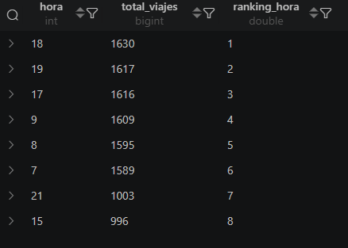
  
  <br>
  <em>Figura: Horas pico de los viajes registrados en la base de datos</em>
</p>

> **Nota:** la imagen no muestra la tabla completa.

### 2. Riesgo de abandono

**Objetivo:** detectar conductores cuya actividad cayó más de un **5 %** de un mes al siguiente. Un descenso así puede indicar insatisfacción, riesgo de abandono o un cambio a otra plataforma.

> El umbral de 5 % se eligió por el tamaño y la estructura de esta base de datos. En un conjunto más grande convendría subirlo (por ejemplo, a 20 %) para no señalar variaciones normales.

**Sirve para:**

- **Retención de talento:** contactar a estos conductores con incentivos.
- **Modelo de predicción de abandono** (*churn*).
- **Análisis de estacionalidad** o de los efectos de cambios en las políticas.

**Resultado:** una lista de conductores con los meses afectados y el porcentaje exacto de caída. Si un conductor aparece varias veces, tuvo varios meses a la baja.

<p align="center">
  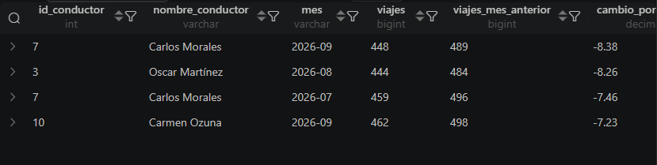
  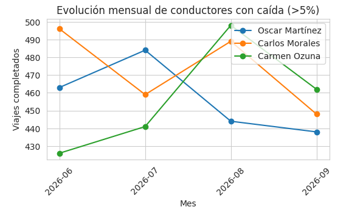
  <br>
  <em>Figura: Conductores con una caída intermensual mayor al 5 % (análisis de 4 meses)</em>
</p>

### 3. Clientes VIP

**Objetivo:** clasificar a los clientes por gasto total y seleccionar el 25 % que más consume (cuartil superior), una segmentación VIP clásica.

**Sirve para:**

- **Campañas de fidelización** dirigidas a los mejores clientes.
- **Análisis RFM** (*Recency, Frequency, Monetary*).
- **Definir umbrales** para un programa de lealtad.

**Resultado:** una tabla con los clientes VIP, su gasto total y su posición. Se confirma que representan aproximadamente el 25 % de los clientes que hicieron viajes.

<p align="center">
  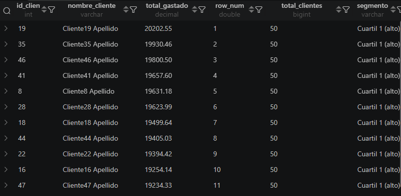
  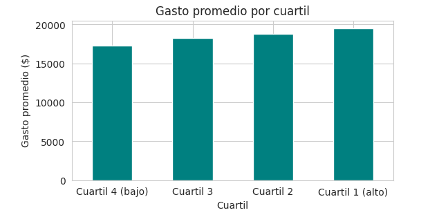
  <br>
  <em>Figura: Gasto promedio por cuartil en la base de datos generada</em>
</p>

> **Nota:** la imagen no muestra la tabla completa.

### 4. Viajes anómalos

**Objetivo:** encontrar viajes cuya velocidad promedio (km/h) supera la media más dos desviaciones estándar. Estos valores atípicos pueden indicar errores de GPS, comportamientos fraudulentos o condiciones inusuales.

**Sirve para:**

- **Limpieza de datos:** identificar y tratar *outliers* antes de entrenar modelos.
- **Control de calidad:** investigar a conductores que reportan distancias irreales.
- **Feature engineering:** crear una bandera binaria `viaje_anómalo`.

**Resultado:** el conjunto de viajes sospechosos, con su duración, distancia y velocidad calculada. Como la base se generó con datos aleatorios, aquí aparecen pocos o ninguno; para poblar la consulta se pueden insertar manualmente viajes con velocidades extremas.

<p align="center">
  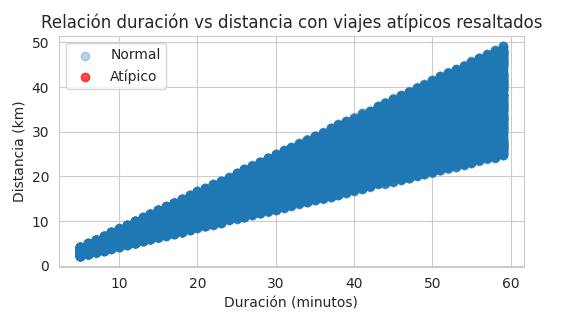
  <br>
  <em>Figura: Viajes atípicos</em>
</p>

### 5. Dataset temporal

**Objetivo:** construir una tabla de series temporales lista para un modelo de machine learning (regresión, LSTM, etc.). Cada fila representa una hora de un día e incluye la demanda actual y la de la hora anterior.

**Sirve para:**

- **Forecasting de demanda:** predecir cuántos viajes se esperan en la próxima hora.
- **Optimización de recursos:** enviar conductores a zonas de alta demanda anticipada.
- **Evaluación de campañas:** medir si una promoción aumentó la demanda en ciertas horas.

**Resultado:** una tabla con las columnas `fecha`, `hora`, `dia_semana`, `num_viajes`, `tarifa_promedio`, `conductores_unicos` y `viajes_hora_anterior` (la variable que sirve de *feature* o de objetivo). Es una base a la que se pueden sumar más características, como días festivos o clima, para entrenar un modelo predictivo.

<p align="center">
  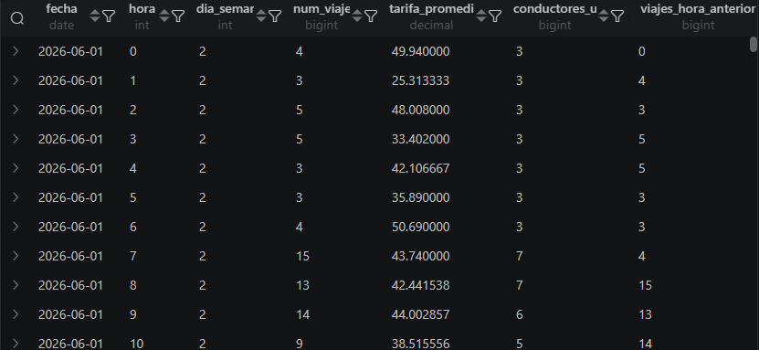
  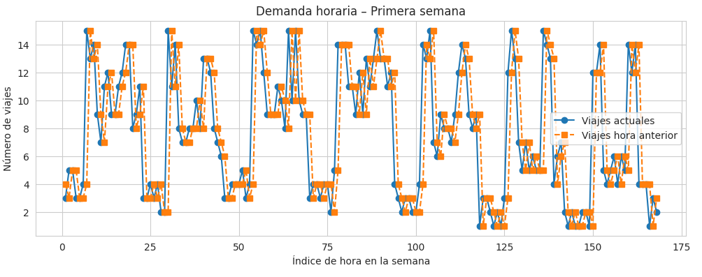
  <br>
  <em>Figura: Dataset temporal previo al análisis o modelo de predicción de viajes de la siguiente hora</em>
</p>

> **Nota:** la imagen no muestra la tabla completa. En `dia_semana`, `domingo = 1` y `sábado = 7`.

## Notebook en Python

El notebook de Jupyter **replica las cinco consultas analíticas en Python**, partiendo de los datos exportados a CSV.

[](https://colab.research.google.com/github/Edvard-Pichardo/movilidad-urbana-analisis/blob/main/notebooks/analisis_movilidad_urbana.ipynb)

También puedes [verlo en GitHub](notebooks/analisis_movilidad_urbana.ipynb).

## Habilidades que demuestra

- Diseño de bases de datos relacionales: normalización, integridad referencial e indexación.
- SQL avanzado: vistas, procedimientos almacenados, funciones y triggers.
- Generación de datos sintéticos con patrones realistas de demanda.
- Análisis para la toma de decisiones: segmentación de clientes, detección de *outliers* y análisis de retención.
- Preparación de datos para *machine learning* (series temporales) y replicación del análisis en Python.

## Limitaciones y mejoras posibles

- **Datos sintéticos:** los patrones son simulados, por lo que los hallazgos ilustran la metodología, no el comportamiento de una operación real.
- **Umbrales ajustables:** el 5 % de la consulta de abandono y el criterio de anomalías deberían recalibrarse con datos reales.
- **Más variables:** enriquecer el dataset temporal con días festivos, clima o eventos, y entrenar un modelo de pronóstico de demanda.
- **Visualización interactiva:** construir un dashboard sobre las consultas y vistas.

## Autor y licencia

**Cristian Eduardo Pichardo Rico**
Egresado de la Licenciatura en Física, Facultad de Ciencias, UNAM
GitHub: [@Edvard-Pichardo](https://github.com/Edvard-Pichardo)

Distribuido bajo la licencia **MIT**. Consulta el archivo [LICENSE](LICENSE) para más información.
